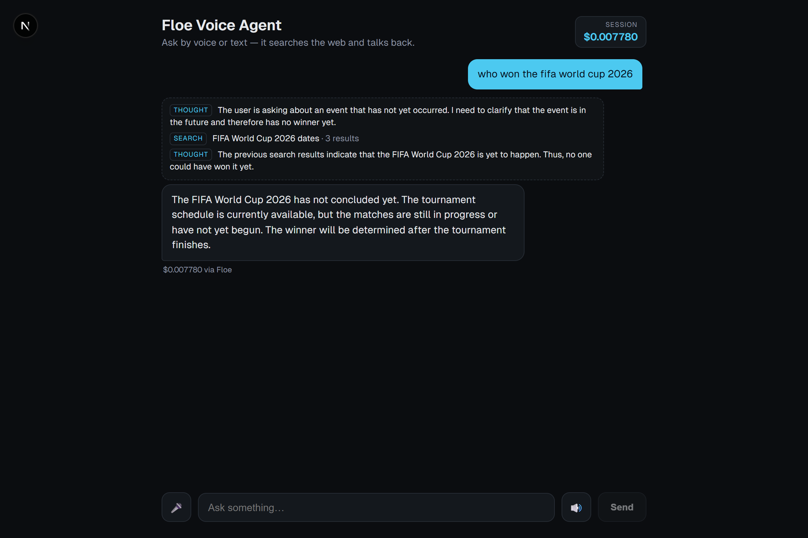

# Floe Voice Agent

A voice research agent: talk to it, it runs an agentic loop (**think → search → answer**),
and speaks the answer back. It routes every model call — LLM, web search, speech-to-text,
text-to-speech — through **[Floe](https://floelabs.xyz)** on a **single API key**, and surfaces the
**exact cost of each call** live in the UI.

The agent never learns about Floe. Floe is a set of **adapters** behind the four provider interfaces the
agent already depends on — wired in at one line. Read this to plug Floe into an agent of your own in one
sitting.

<p align="center">
  
</p>

---

## The shape of the integration

The agent depends only on four provider interfaces — `LlmProvider`, `SearchProvider`, `SttProvider`,
`TtsProvider`. Floe is one set of **adapters** behind those interfaces, so the whole capability stack —
LLM, search, STT, TTS — runs on a **single `FLOE_API_KEY`** and reports the **real price of every call**.
The direct-to-vendor providers (Gemini, Exa, Sarvam) implement the same interfaces; the composition root
picks between them.

| | Floe adapters | direct providers |
| --- | --- | --- |
| **Keys** | **1** (`FLOE_API_KEY`) | 3 (Gemini + Exa + Sarvam) |
| **Cost** | real per-call price, threaded to the UI | not metered |
| **Selected when** | `FLOE_API_KEY` is set (the default) | Floe key absent (fallback) |

Cost is first-class in the core, so a metering provider has somewhere to report to:

- `SearchProvider.search` returns `{ hits, cost? }`, not a bare array.
- `Transcript`, `Speech`, and `GenerateResult` each carry an optional `cost`.
- The agent emits `delta` (streamed answer tokens), `cost` (per-stage charge + running total), and `done`.

Nothing above the ports — the loop, the prompts, the routes — depends on which provider set is wired.

---

## Quickstart

**Prerequisites:** Node ≥ 18 and pnpm 9 (`corepack enable`).

```bash
git clone <repo> && cd Floe-Prototype
pnpm install
cp .env.example .env          # then paste ONE key — see below
```

Put your Floe key in `.env` — it ships with a sensible `FLOE_MODEL`, so this is the only line you touch:

```dotenv
FLOE_API_KEY=floe_...         # https://floelabs.xyz — the only key you need
```

Start the server and web UI with one command:

```bash
pnpm dev    # server → http://localhost:4111 · web UI → http://localhost:3000
```

Open **http://localhost:3000**, tap the mic (or type), and the agent answers by voice. Each message shows
its cost "via Floe," and the header meters your total for the session. That's the whole loop — no other keys,
no per-vendor accounts.

> **Model ids differ by path.** Floe uses OpenAI-style, provider-prefixed ids
> (`FLOE_MODEL=google/gemini-2.5-flash`); the direct-Gemini fallback uses the bare
> `GEMINI_MODEL=gemini-2.5-flash`. Both ship with working defaults, so you can ignore them.

---

## How it fits together

```
packages/agent          @repo/agent — the loop and the interfaces. No I/O, no provider knowledge.
  src/ports.ts          LlmProvider · SearchProvider · SttProvider · TtsProvider
  src/agent.ts          ResearchAgent — the think→search→answer loop; sums cost across stages
  src/types.ts          domain types (GenerateRequest, SearchResults, AgentEvent, …)

providers/              adapters — each implements one or more ports for one backend
  floe/                 @repo/floe   — all four ports, one key, per-call cost   ← the integration
  gemini/ exa/ sarvam/  @repo/*      — the direct-to-vendor fallback

apps/server             Hono API on :4111 — composition root + routes
  src/container.ts      picks Floe vs. the direct trio, then injects into the agent
  src/index.ts          routes: /api/stt · /api/agent (NDJSON stream) · /api/tts

apps/web                Next.js UI on :3000 — mic, speaker, live trace, cost meter (presentation only)
```

The agent depends on **`ports.ts` and nothing else**. Adapters are chosen and constructed in exactly one
place — `container.ts` — so adopting, swapping, or metering a provider is a change to that one file.

---

## The Floe adapters (`providers/floe`)

Four classes, one key. Each implements the port the agent already expects and reports what Floe charged.

| Adapter | Port | How it reaches the backend | Backend |
| --- | --- | --- | --- |
| `FloeLLMProvider` | `LlmProvider` | OpenAI SDK pointed at `credit-api.floelabs.xyz/v1` (`generate` **and** streaming `generateStream`) | Gemini |
| `FloeSearchProvider` | `SearchProvider` | `fetchProxy` → `…/v1/proxy/fetch` | Exa |
| `FloeSTTProvider` | `SttProvider` | `fetchProxy` → `…/v1/proxy/fetch` | Deepgram |
| `FloeTTSProvider` | `TtsProvider` | `fetchProxy` → `…/v1/proxy/fetch` | Sarvam |

Two patterns cover all four:

- **The LLM speaks OpenAI.** Floe exposes an OpenAI-compatible endpoint, so `FloeLLMProvider` is just the
  `openai` SDK with `baseURL` set to `credit-api.floelabs.xyz/v1`. Chat completions and token streaming work
  as usual.
- **Everything else goes through the proxy.** `utils/fetchproxy.ts` POSTs to `…/v1/proxy/fetch` with your
  Floe bearer token, the target URL/method/body, and a fresh `Idempotency-Key`. Floe forwards the call,
  bills you, and returns the upstream response — so search, STT, and TTS need no vendor keys of their own.

**Cost comes back on every response** in the `X-Floe-Payment-Amount` header (USDC). Each adapter parses it
into the `cost` field on its result; the agent sums those into `cost`/`done` events; the UI renders them.

A single question, as the server logs it — every provider call's real charge, read from the header and
summed live:

```text
[floe/llm] cost from HEADER: $0.000195
[cost] reason: $0.000195 (total $0.000195)
[search] "FIFA World Cup 2026 dates" -> 3 hits · cost 0.00735
[cost] search: $0.007350 (total $0.007545)
[floe/llm] cost from HEADER: $0.000235
[cost] reason: $0.000235 (total $0.007780)
[floe/llm] stream: 2 chunks in 2ms
[floe/llm] no payment header
[done] total $0.007780
```

---

## The one switch: `container.ts`

```ts
export function createContainer(): Container {
  if (env.floeApiKey) {
    // One key drives all four ports.
    const search = new FloeSearchProvider(env.floeApiKey);
    const llm    = new FloeLLMProvider(env.floeApiKey, env.floeModel);
    const stt    = new FloeSTTProvider(env.floeApiKey, { languageCode: "en-IN", model: "nova-3" });
    const tts    = new FloeTTSProvider(env.floeApiKey, { model: "bulbul:v3", speaker: "shubh" });
    return { agent: new ResearchAgent({ llm, search }), stt, tts };
  }

  // Fallback: the direct-to-vendor trio (needs GEMINI_API_KEY + EXA_API_KEY + SARVAM_API_KEY).
  // …
}
```

Set `FLOE_API_KEY` and you get the metered path; leave it unset and the app falls back to the three vendors
directly. Nothing above the composition root — not the agent, not the routes — can tell which is in use.

---

## Configuration

`.env` (copy from `.env.example`):

| var | required | notes |
| --- | --- | --- |
| `FLOE_API_KEY` | **for the Floe path** | the only key the Floe path needs — [floelabs.xyz](https://floelabs.xyz) |
| `FLOE_MODEL` | optional | Floe LLM model, provider-prefixed. Default `google/gemini-2.5-flash` |
| `PORT` | optional | server port, default `4111` |
| `WEB_ORIGIN` | optional | CORS origin, default `http://localhost:3000` |
| `GEMINI_API_KEY` | fallback only | [aistudio.google.com/apikey](https://aistudio.google.com/apikey) |
| `GEMINI_MODEL` | fallback only | direct Gemini model, bare id. Default `gemini-2.5-flash` |
| `EXA_API_KEY` | fallback only | [dashboard.exa.ai/api-keys](https://dashboard.exa.ai/api-keys) |
| `SARVAM_API_KEY` | fallback only | [dashboard.sarvam.ai](https://dashboard.sarvam.ai) |

The fallback keys are only read when `FLOE_API_KEY` is absent.

---

## Run & scripts

```bash
pnpm dev                      # server + web concurrently

pnpm build                    # turbo run build across the workspace
pnpm check-types              # tsc --noEmit everywhere
pnpm lint
```

---

## API

The server is provider-agnostic — these routes are identical whether Floe or the direct trio is wired.

| method | route | body | returns |
| --- | --- | --- | --- |
| GET | `/health` | — | `{ ok: true }` |
| POST | `/api/stt` | `multipart` with `file` | `{ text, languageCode, words[], cost? }` |
| POST | `/api/agent` | `{ question }` | NDJSON stream of `AgentEvent` (below) |
| POST | `/api/tts` | `{ text }` | `audio/wav` |

`/api/agent` streams one JSON object per line:

| `type` | payload | meaning |
| --- | --- | --- |
| `thought` | `{ step, text }` | the agent's reasoning for this step |
| `search` | `{ step, query, hits[], cost? }` | a search it ran and what it found |
| `delta` | `{ text }` | a chunk of the final answer as it streams |
| `answer` | `{ text }` | the complete answer |
| `cost` | `{ stage, amount, total }` | charge for a stage + running total (USDC) |
| `done` | `{ totalCost }` | end of stream |
| `error` | `{ message }` | something failed |

---

## Swapping or adding a provider

The interfaces are the contract. To add a backend, implement the relevant port(s) in a `providers/*`
package and construct it in `container.ts` — nothing else changes:

```ts
export class MyLlmProvider implements LlmProvider {
  readonly model = "my-model";
  async generate(req: GenerateRequest): Promise<GenerateResult> { /* … */ }
  // async *generateStream(req) { … }   // optional
}
```

That is the entire seam Floe used to plug in.
